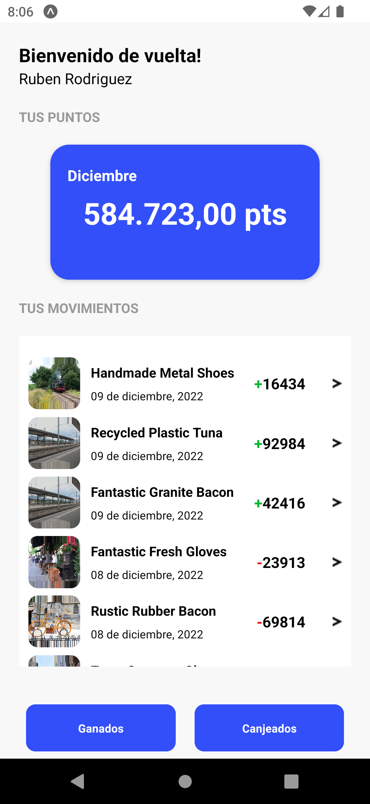
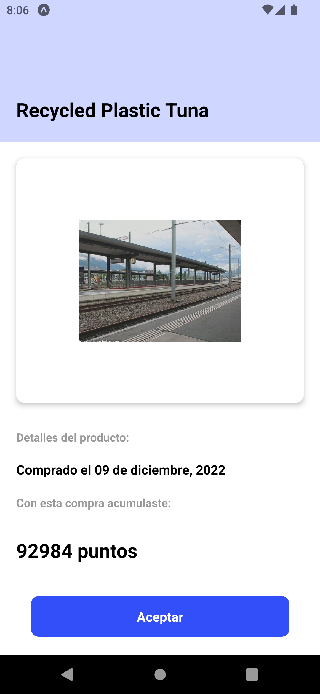
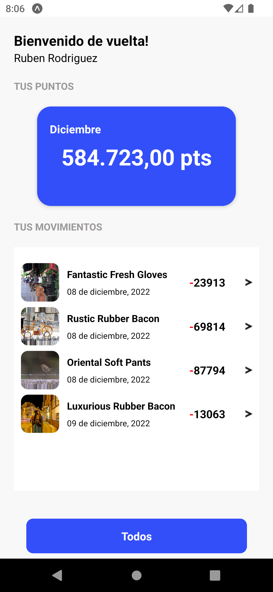
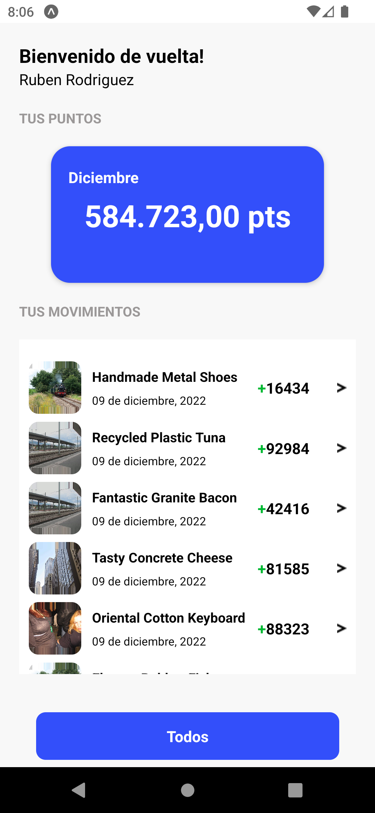
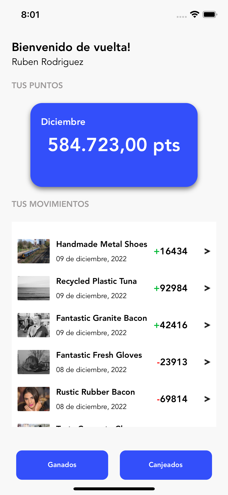
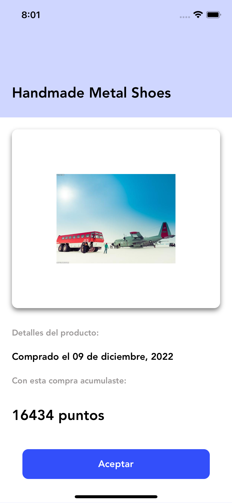
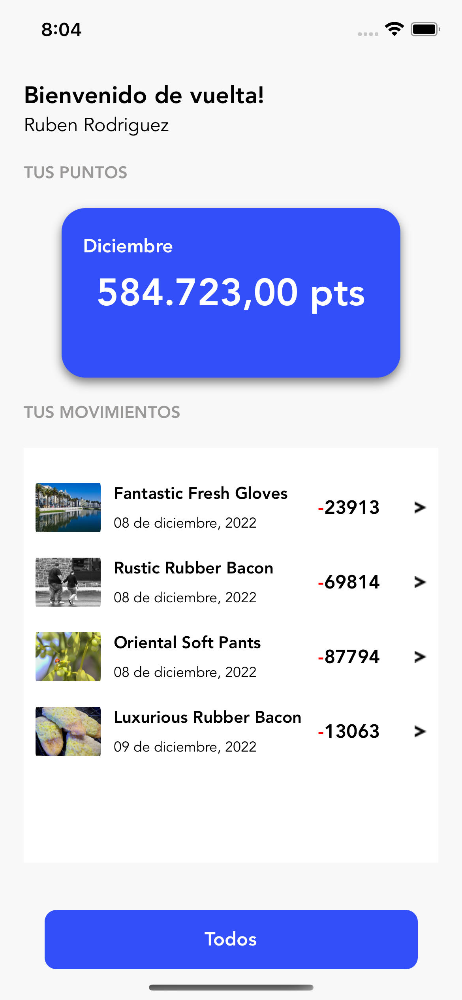
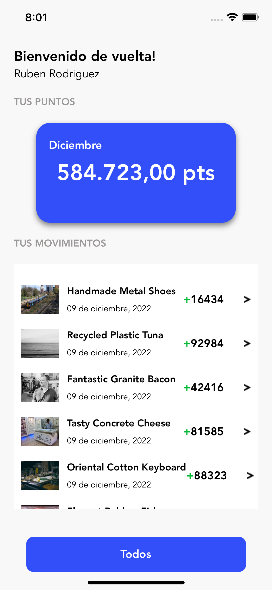

# Digital House

This is a mobile application built with React Native for the Digital House test.

## Android

<table style="border: 0">
  <tr>
    <td align="center"></td>
    <td align="center"></td>
    <td align="center"></td>
    <td align="center"></td>
  </tr>
</table>

## iOS

<table style="border: 0">
  <tr>
    <td align="center"></td>
    <td align="center"></td>
    <td align="center"></td>
    <td align="center"></td>
  </tr>
</table>

## Getting Started

To get a local copy of this project up and running, follow the steps below.

### Prerequisites

- Please follow the official doc to config your enviroment setup or update some dependencies if case the are deprecated
- You will need to have the following software installed on your machine:
  - [Node](https://nodejs.org/en/) (v14 or newer)
  - [Yarn](https://yarnpkg.com/) (v1 or newer)
  - [Git](https://git-scm.com/)
  - [React Native](https://reactnative.dev)
  - [React Navigation](https://reactnavigation.org/)

### Steps

- Clone the repository:
  git clone https://github.com/iJesusApm/digital-house.git
- Navigate into the project directory:
  cd digital-house
- Install the dependencies:
  `yarn install`
- Start the development server:
  `yarn start`
- Run the app on Android:
  `yarn android`
- Run the app on iOS
  `yarn iOS`

### Project Structure

From src:

- assets/: all the resources has been used in the app, like images, icon or fonts.
- components/: reusable components used across different screens.
- containers/: screen components that render the UI and handle user interaction.
- navigations/: the app's navigation components and configuration.
- services/: API service and other external services.
- styles/: color, typography and other styles.
- utils/: helper functions and utility modules.
- App.tsx: the main entry point of the app.

### Running tests

This project uses Jest and React Native Testing Library for testing.

- To run tests, run the following command:
  - `yarn test`
- To see coverage by all tests, run the following command:
  - `yarn test-coverage`
